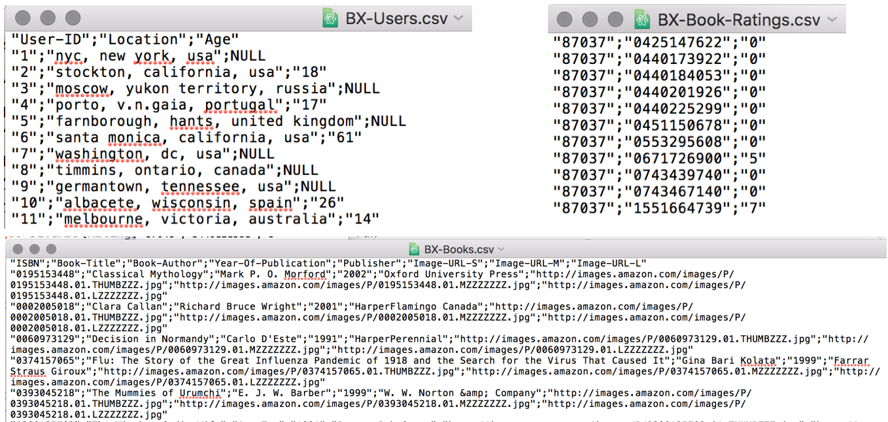
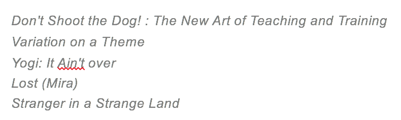
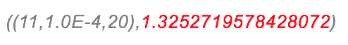

# 期末專案: 書本評論推薦系統

## 動機

#### 題目動機

為隨著社會的進步，每年都有大量的書被出版，這些海量的知識已經不是我們有生之年所能吸收的完，因此我們必須慎選真正對自己有幫助的書，也就是藉由推薦系統來找出和自己相近閱讀興趣的人所喜愛的書，進而從茫茫書海中找出適合自己的書，而不是像以往只看封面就決定要看哪本的習慣。

#### 技術動機

實作老師上課教的neighborhood method在spark平台上並且和spark現有的推薦系統（Alternating Least Square）來比較。最後在這兩個實作的技術上進行參數調校，探討參數和準確率之間的關係。

## 目標

1. 以spark平台來實作兩個推薦方法
2. 針對各個推薦方法進行參數調校

## 方法

1. 把原始的文字資料分割成所希望的屬性格式
2. 處理遺失的資料
3. 如果ID欄位不全是整數的話，要新建hash table來做對應
4. 要把User.csv跟Book.csv的檔案整合進來的話，也各新建一個hash table才能對應使用
5. 把資料轉換成LabelPoint的形式才能餵進spark的model裡計算MSE，這是用來計算誤差的，再加上根號就成了標準差。也就是Rating的分數作預測值和真實值的相減後平方再取mean，我會以Mean square error來計算誤差找出評價誤差最小的，從而選出最適當的推薦系統。

## 輸入資料

The Book-Crossing dataset comprises 3 tables.

#### BX-Users
Contains the users. Note that user IDs (`User-ID`) have been anonymized and map to integers. Demographic data is provided (`Location`, `Age`) if available. Otherwise, these fields contain NULL-values.

#### BX-Books
Books are identified by their respective ISBN. Invalid ISBNs have already been removed from the dataset. Moreover, some content-based information is given (`Book-Title`, `Book-Author`, `Year-Of-Publication`, `Publisher`), obtained from Amazon Web Services. Note that in case of several authors, only the first is provided. URLs linking to cover images are also given, appearing in three different flavours (`Image-URL-S`, `Image-URL-M`, `Image-URL-L`), i.e., small, medium, large. These URLs point to the Amazon web site.

#### BX-Book-Ratings
Contains the book rating information. Ratings (`Book-Rating`) are either explicit, expressed on a scale from 1-10 (higher values denoting higher appreciation), or implicit, expressed by 0.

## 實驗結果

給使用者ID為87351的推薦5本書

此model最好的參數及最佳的MSE為

## 實驗結論

1. 實作出基於ALS的推薦系統
2. Neighborhood method 不適合用在大量資料且分散式的平台上
3. ALS的方法沒問題，且進行了參數調校找出了參數和準確度之間的關係
4. 通常model預設的參數值效果都相當好，這也應證了在大部分的情況下都是不錯才會當作預設值

## Reference: 
1. http://spark.apache.org/docs/latest/mllib-collaborative-filtering.html
2. http://www2.informatik.uni-freiburg.de/~cziegler/BX/
3. https://en.wikipedia.org/wiki/Mean_squared_error
